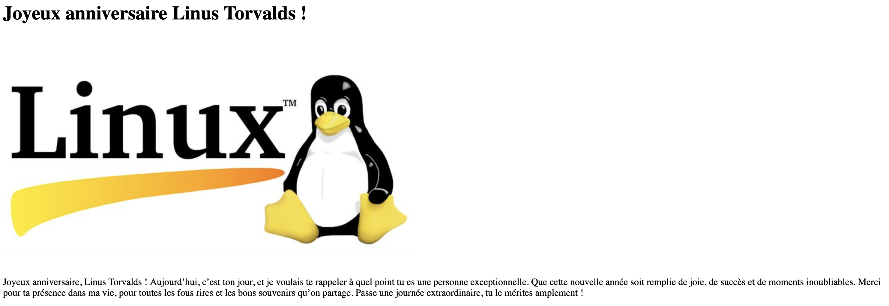
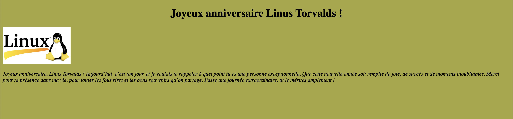

# Apprendre le Developpement Web
### :rotating_light: Page en cours de création :construction:

---

## Présentation

:wave: **Bienvenu !**
A travers les différentes activités vous allez **apprendre les bases pour débuter dans le développement web**. Dans chaque activité vous allez apprendre les bases petit à petit à votre rythme. **Chaque activité sera guider** pour ne pas vous laisser seul! Le but est que vous puissiez tout apprendre sans avoir besoin d'internet, tout se trouve dans les fichiers de codes sources en commentaire, dans les anciennes activités et surtout dans [ce fichier](#apprendre-le-developpement-web) que vous devrez utiliser pour avoir la consigne, information, etc... (de l'activité en question).

---

## Sommaire

---

## Activité 0 : Les bases

Avant de commencer il faut comprendre les différents langages que nous allons utiliser à travers les activités:

- `HTML`(*HyperText Markup Language. En français: langage de balises pour l'hypertexte*).
- `CSS`(*Cascading Style Sheets. En français: Feuilles de style en cascade*).
- `JS` (*JavaScript.*).
- `PHP`(*Hypertext Preprocessor. En français: Préprocesseur Hypertexte. Oui c'est pas très claire pour le moment* :smile:.)

---

#### :one: `HTML`:

Ce langage nous permet de **créer la structure de notre page web**. Sans lui notre site n'existe pas. Pour les débutant il est assez facile à comprendre. C'est un **language baser sur des balises** comme le `XML`. Ex: ``<h1>Titre</h1>``. (*Cette balise permet d'écire un texte en tant que titre de niveau 1*).
Comme vous l'avez remarquer il y a 2 balises qui encadre le contenu.
La première s'appelle la **balise ouvrente**: ``<h1>`` et la deuxième s'appelle la **balise fermante**: ``</h1>``. La balise fermante à toujours un `/` juste après le premier chevron.

:warning: Il existe des exceptions. Certaines balises utilise qu'une seule balise, se sont des balises: **autofermantes** :

```HTML
 Image
<input> Saisie de champs pour formulaire
<br> Saut de ligne
<hr> Insert une ligne horizontale de séparation
<meta> Métadonnées concernant une page web
<link> Lier des fichiers externes
<base> Définit l'URL de base pour tous les liens relatifs dans un document
<area> Définir une zone dans une image map
<col> Propriétés pour des colonnes dans un tableau
<embed> Intégrer des ressources
```

---

Voilà vous vennez d'apprendre 50% de la base du `HTML`.
Attention! Il reste d'autres éléments à voir mais ils seront aborder durant les activités. Chaque choses en son temps! Tout d'abort la première question qui devrais vous traverser l'esprit c'est: 

>Comment on créer une page HTML?

Et voilà:

````HTML
<!doctype html>
<html lang="fr">
  <head>
    <meta charset="utf-8" />
    <meta name="viewport" content="width=device-width" />
    <title>Titre de la page</title>
  </head>
  <body>
    <h1>Hello, World!</h1>
  </body>
</html>
````

Décortiquons ensemble ce code source:

- `<!doctype html>` Cette balise indique au navigateur que le document est en HTML5.
- `<html></html>` Cette englobe tout le contenu de la page HTML. `lang="fr"` Cet attribut spécifie la langue principale du document, ici le français.
- `<head></head>` Cette section contient des métadonnées sur le document. (*des liens vers des fichiers externes (CSS, scripts) et d'autres informations qui ne sont pas visibles pour l'utilisateur.*).
- `<meta charset="utf-8" />` Cette balise autofermantes contient des informations sur les métadonnées de la page.
`charset="utf-8"` Cet attribut spécifie l'encodage des caractères utilisés dans le document. Ici c'est en `utf-8`. Cet encodage est très utiliser, car il permet de représenter pratiquement tous les caractères utilisés dans le monde.
- `<meta name="viewport" content="width=device-width" />` Encore une balise auto-fermante de métadonnées. `name="viewport"` Cet attribut contrôle l'affichage de la page sur des appareils mobiles. `content="width=device-width"` Ce paramètre spécifie que la largeur du viewport doit correspondre à la largeur de l'écran de l'appareil. Cela est important pour rendre notre site **Responsive**.
- `<title></title>` Cette balise définit le titre du document. C'est ce qui apparaît dans l'onglet du navigateur et dans les résultats des moteurs de recherche.
- `<body></body>` Cette balise contient tout ce qui sera visible par l'utilisateur sur la page web. C'est le corps de votre site.
- `<h1></h1>` Comme expliquer tout à l'heure, cette balise est utilisée pour définir un titre de niveau 1. Il existe 6 niveaux de titre de `<h1>` à `<h6>`.

---

#### :two: `CSS`:

Ce langage vas nous permettre d'ajouter du style à notre page. Sans lui notre site sera "Brut" sans mise en forme. A l'instars du `HTML`, le `CSS` n'es pas très compliquer à comprendre.
Pour écrire du code source en `css`, il faut le nom de l'élément que nous voulons styliser et puis on commence à écrire.
:warning: Il y a différentes façons d'écrire le style d'un élément.
- Pour une balise, il faut utiliser le nom de la balise sans les chevrons. (ex: body)
- Pour une classe, il faut utiliser le nom de la classe avec un point devant. (ex: .logo) 
- Pour un id, il faut utiliser le nom de l'id avec un dièse devant. (ex: #nom)

Voici un exemple avec la balise `<body>`.

```css
body{
  background-color: blue; /* bleu */
}
```

Ici, nous avons ajouté une couleur d'arrière-plans dans la balise body.
>:warning: Si vous voulez changer la couleur d'un titre qui se trouve dans une balise `<h1>`, si vous utiliser le nom de sa balise alors tout les titres dans une balise `<h1>` auront le même style. Pour palier à cas il y a deux solutions: soit utiliser une classe ou un id.
> [explication](#liaison-html-css)
>- **Une classe** permet d'ajouter du style à plusieur éléments différents.
>- **Un Id** permet d'ajouter du style à un seul élément.


Voici un exemple d'une classe `.important`:

```css
.important{
  color: #ed2b38; /* rouge */
  font-weight: bold; /* texte en gras */
}
```

Ici, nous avons ajouter une couleur au texte et nous modifier ce texte en gras. Donc toutes les balises ayant en classe `important` hériteront de ce style.

Voici un exemple d'id `#envoyer`:

```css
#envoyer{
  background-color: rgb(31 120 50); /* vert */
  height: 50px; /* Hauteur de 50 pixels */
  width: 100px; /* Largeur de 100 pixels */
}
```

Ici, nous avons ajouter une couleur d'arrière-plans, une hauteur et une largeur à la balise ayant comme id `envoyer`.

---

##### Liaison `html` `css`

Pour lier une feuille de style `css` à un fichier `html`. Il faut ajouter à l'intérieur de la balise `head` le liens vers la feuille de style:

```html
<link href="style.css" rel="stylesheet" type="text/css" />
```

Dans un fichier `html` une classe s'ajoute dans une balise comme ceci:

```html
<h1 classe="maClasse">Titre</h1>
```

Et pour l'id:

```html
<h1 id="monID">Titre</h1>
```

---

Aujourd'hui en css on peut faire beaucoup de choses. C'est pour cela que dans l'introduction je ne vous présente pas touts car ça serait beaucoup trop long. Et de toute façons vous aller les découvrir tout au long des activités.

---

#### :three: `JS` ou `JavaScript`:

Le `javascript` est un langage de programmation dynamique qui permet de rendre intéracrif votre site. Contrairement au autres langages que je viens de vous présenter celui-ci ressemble à du "vrai code". Si vous avez déja toucher au `C`, `C++` ou `Java`, la syntaxe vous sera donc familiaire. Mais pour les autres voici à quoi ça ressemble:

```js
console.log("Hello, World!");
```
Ici le script vas écrire dans la console du navigateur: `Hello, world!`.
:warning: Il est **OBLIGATOIRE** de mettre un **`;`** à chaque fin de ligne (pas comme en `python` par exemple).

### Partie 1 : Faire sa première page HTML

Votre travail sera le suivant :  
> Vous allez devoir créer une page web pour souhaiter l'anniversaire de votre meilleur ami, `Linus Torvalds`.  
Pour vous aider, vous trouverez des fichiers `exemple` dans le répertoire de cette `Activité 0`.

Dans le fichier `partie1.html`, vous allez devoir ajouter :  

- Un nom à votre page ;  
- Un titre qui souhaite un joyeux anniversaire à votre ami ;  
- Une image de votre choix ;  
- Un petit message de votre part pour son anniversaire.  

Voici ce que vous devez obtenir :  

  

---

### Partie 2 : Améliorer le fichier

Maintenant que vous avez créé la base, vous allez maintenant jouer les artistes en ajoutant du style à votre page.  
Votre travail sera le suivant :  

- Centrer le titre ;  
- Ajouter une couleur de fond ;  
- Ajuster la taille de l'image ;  
- Mettre le paragraphe en italic.  

Pour réaliser cela, vous allez devoir ajouter du style dans le fichier `partie2.css`, puis lier ce fichier CSS au fichier HTML de la partie précédente `partie1.html`.  

Voici ce que vous devez obtenir :

